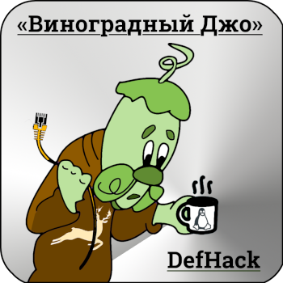

# DefHack 2018.9: Виноградный Джо
### О том, как сисадмин Виноград оказался не таким уж неуловимым

Приглашаем принять участие в нашем хакерском квесте DefHack на конференции NeoQUEST-2018! Он будет доступен онлайн с 26 сентября.

В квесте представлен виртуальный мир анти-утопии, по которому вам предстоит путешествовать, выполняя различные задания. Всё начинается с поступления на работу в отдел расследования инцидентов Ё-корп. Распутывание дел в роли "белого" хакера приведет вас к встрече с интересными противниками -- вы познакомитесь с яркими представителями группировок в "серых" и "чёрных" шляпах. Каждый ваш шаг сказывается на окружающем мире, отражаясь через призму новостного сайта корпорации. По мере того, как вы узнаете стороны конфликта получше, вам, как и в жизни, представится возможность выбора. От того, чью сторону вы примете, зависит судьба этого мира.

Категории заданий, включенные в версию DefHack 2018.9:

- форензика, расследования (сеть, диск)
- веб
- разведка, osint
- mitm
- brute-force
- pwn
- повышение привилегий
- смарт-контракты Этериум

Составляя задания, мы старались приблизить их к реалистичным, потенциально возможным ситуациям. Большинство заданий, надеемся, полезны и для отработки базовых методов атаки, и понимания возможных методов защиты.

DefHack 2018.9: Виноградный Джо является первым дополнением к оригинальному релизу DefHack 2018.5: Ход Слоном.

## Таблица результатов

[http://neoquest.dc20e6.ru](http://neoquest.dc20e6.ru), обновляется примерно раз в 10 минут.

## Призы для победителей

Призы вручаются очным участникам конференции NeoQUEST-2018.

Победители определяются следующим образом:

- Прошедшие всю квестовую линию полностью -- их мы занесем в Зал Славы DefHack!
- Первый прошедший линию квестов про Винограда
- Прошедшие максимальное количество квестов

Все лучшие участники получат футболки с логотипом DEFCON NN в новом цвете (Cyan).

Первое место:
- экшн-камера от команды NeoQUEST
- рюкзак от "Гарда Технологии"
- футболка от команды DefHack

Второе место:
- зонт от "Гарда Технологии"
- футболка от команды DefHack

Третье место:
- кружка от "Гарда Технологии"
- футболка от команды DefHack

Четвертое-пятое места:
- футболка от команды DefHack

## О механике квеста

Для начала квеста вам необходимо присоединиться к телеграм-чату [@defhack2018_neoquest](https://t.me/defhack2018_neoquest) и зарегистрироваться на игровом сайте. Регистрация откроется 26 сентября.

* Задания выдаются через встроенного в сайт чат-бота
* Некоторые задания требуют сдать какой-либо ключ боту прямо в чат -- он явно говорит об этом в таком случае
* Выполнение некоторых заданий трекается автоматически
* Бот может выдавать подсказки в зависимости от уровня вашего прогресса в каждом из заданий (попробуйте спросить)
* После выполнения каждого задания на главной странице сайта появляется новость, как-то связанная с происходящими событиями

Вопросы можно задавать в телеграм-чате [@defhack2018_neoquest](https://t.me/defhack2018_neoquest). Там же будут даваться дополнительные подсказки.

## Что требуется для участия

Участвовать можно как в одиночку, так и в команде. Сложность большинства заданий -- легкая или средняя, они вполне по силам любому админу, программисту, тестировщику, и тем более пентестеру. Рекомендуем использовать какой-либо дистрибутив Linux. Вам потребуется настроенный [Tor](https://torproject.org) — не только браузер, но и возможность перенаправлять в него трафик приложений (например, с помощью torsocks и [torify](https://linux.die.net/man/1/torify)).

## Правила поведения

Запрещено атаковать инфраструктуру квеста. Если вы обнаружите какую-либо уязвимость в ней, пожалуйста сообщите нам об этом приватно (администраторам чата [@defhack2018_neoquest](https://t.me/defhack2018_neoquest), например [@wsnark](https://t.me/wsnark)).

Если вы видите какой-либо хост, похожий на инфраструктурный, но не уверены - не стесняйтесь, уточните в чате.

В процессе решения заданий вы получите доступ к персональному контейнеру. Запрещается абьюзить этот доступ:

- делать чрезмерные вычисления на CPU
- перегружать сетевой канал, проводить сканирование хостов в Интернете и т.д.
- перегружать жесткий диск данными
- пытаться получить доступ за пределами контейнера

Все игровые контейнеры мониторятся, в случае обнаружения абьюза игрок дисквалифицируется и не сможет продолжить участие в квесте.

При необходимости можно писать организаторам лично: Wire Snark ([@wsnark](https://t.me/wsnark)).

## Об авторах

Квест создается участниками сообществ [DC7831 (Нижний Новгород)](http://defcon-nn.ru) и [DC20e6 (Ульяновск)](https://dc20e6.ru) на некоммерческой основе.

* Ведущие разработчики (платформа, квесты): swan'i [@lebik](https://t.me/lebik), Ilya Lenin [@LeninOne](https://t.me/LeninOne), AI OI [@vlllo](https://t.me/vlllo), Nikita Baksalyar [@nbaksalyar](https://t.me/nbaksalyar), Wire Snark [@wsnark](https://t.me/wsnark), Artyom Poptsov [@a_v_p](https://t.me/a_v_p)
* DevOps: Alexey Extor [@extor](https://t.me/extor)
* Разработчики: Roman [@deadroot](https://t.me/deadroot), Egor Podmokov [@podmokov](https://t.me/podmokov), Vladimir Vlasov [@HiVaccessdenied](https://t.me/HiVaccessdenied), [@Illey](https://t.me/Illey)
* Графика, изображения, стиль: Olga Sviridova [@barsuchiha](https://t.me/barsuchiha), Елена Л
* Тексты, сценарии: Wire Snark [@wsnark](https://t.me/wsnark), [@g0rd1as](https://t.me/g0rd1as), Artyom Poptsov [@a_v_p](https://t.me/a_v_p)
* Руководитель: Wire Snark [@wsnark](https://t.me/wsnark)
* Благодарности: Руслан [@gnurian](https://t.me/gnurian)

Исходный код системы будет опубликован под открытыми лицензиями.

## О спонсорах призов для очного тура релиза DefHack 2018.09

"Гарда Технологии" -- российский разработчик систем информационной безопасности. Команда разработчиков обладает многолетним опытом в сфере информационных технологий и создает решения для различных задач безопасности. Разработки аппаратно-программных решений информационной безопасности ведутся с 2005 года. Решения «Гарды Технологии» внедрены в крупнейших компаниях финансового сектора, промышленных предприятиях, телеком-операторах и государственных структурах России и СНГ.
