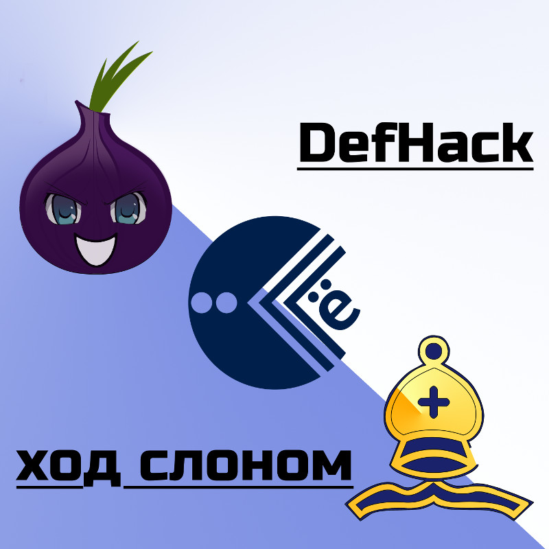

# DefHack 2018.5: Ход слоном

Приглашаем принять участие в нашем хакерском квесте DefHack! Он доступен онлайн с вечера пятницы, 20 июля.

В квесте представлен целый виртуальный мир с квестовой линией, которая позволит взглянуть на безопасность с разных сторон классического конфликта «белых», «серых» и «черных» хакеров. От того, какую сторону вы примете, зависит судьба этого мира. На пути вам встретятся задания различной сложности и разных категорий — от форензики и веба до pwn и поиска уязвимостей в смарт-контрактах.

## О механике квеста

 Для начала квеста вам необходимо присоединиться к телеграм-чату [@defhack2018_summer](https://t.me/defhack2018_summer) и зарегистрироваться на сайте [Ё-корп](https://yo-corp.ru). 

* Задания выдаются через встроенного в сайт чат-бота (вкладка Чат доступна после регистрации) 
* Некоторые задания требуют сдать какой-либо ключ боту прямо в чат -- он явно говорит об этом в таком случае
* Выполнение некоторых заданий трекается автоматически
* Бот может выдавать подсказки по мере вашего прогресса по квесту (попробуйте спросить)
* После выполнения каждого задания на главной странице сайта появляется новость, как-то связанная с происходящими событиями

Вопросы можно задавать в телеграм-чате [@defhack2018_summer](https://t.me/defhack2018_summer). Там же будут даваться дополнительные подсказки.

## Что требуется для участия

Участвовать может любой человек или команда. Рекомендуем использовать Kali Linux или какой-либо другой дистрибутив. Вам потребуется настроенный [Tor](https://torproject.org) — не только браузер, но и возможность перенаправлять в него трафик приложений (например, с помощью torsocks и [torify](https://linux.die.net/man/1/torify)).

## Правила поведения

Запрещено атаковать инфраструктуру квеста. Если вы обнаружите какую-либо уязвимость в ней, пожалуйста сообщите нам об этом приватно (администраторам чата [@defhack2018_summer](https://t.me/defhack2018_summer), например [@wsnark](https://t.me/wsnark)).
Инфраструктура включает в себя:

- сайт yo-corp.ru*, wallet.yo-corp.ru
- внутреннюю docker-инфраструктуру

*На сайте yo-corp.ru есть ровно одна игровая уязвимость, цель второго квеста.

Если вы видите какой-либо хост, похожий на инфраструктурный, но не уверены - не стесняйтесь, уточните в чате.

В процессе решения заданий вы получите доступ к персональному контейнеру. Запрещается абьюзить этот доступ:

- делать чрезмерные вычисления на CPU
- перегружать сетевой канал, проводить сканирование хостов в Интернете и т.д.
- перегружать жесткий диск данными
- пытаться получить доступ за пределами контейнера

Все игровые контейнеры мониторятся, в случае обнаружения абьюза игрок дисквалифицируется и не сможет продолжить участие в квесте.

При необходимости можно писать организаторам лично: Wire Snark ([@wsnark](https://t.me/wsnark)).

## Таблица результатов

[http://phd8.dc20e6.ru](http://phd8.dc20e6.ru), обновляется примерно раз в 10 минут.

## Об авторах

Квест создается участниками сообществ DC7831 (Нижний Новгород) и [DC20e6 (Ульяновск)](https://dc20e6.ru).

* Ведущие разработчики (платформа, квесты): swan'i [@lebik](https://t.me/lebik), Ilya Lenin [@LeninOne](https://t.me/LeninOne), AI OI [@vlllo](https://t.me/vlllo), Nikita Baksalyar [@nbaksalyar](https://t.me/nbaksalyar), Wire Snark [@wsnark](https://t.me/wsnark)
* DevOps: Alexey Extor [@extor](https://t.me/extor)
* Разработчики: Egor Podmokov [@podmokov](https://t.me/podmokov), Vladimir Vlasov [@HiVaccessdenied](https://t.me/HiVaccessdenied), Roman [@deadroot](https://t.me/deadroot), [@Illey](https://t.me/Illey)
* Графика, изображения, стиль: Olga Sviridova [@barsuchiha](https://t.me/barsuchiha), Елена Л
* Тексты: Wire Snark [@wsnark](https://t.me/wsnark), [@g0rd1as](https://t.me/g0rd1as)
* Автор сценария, руководитель: Wire Snark [@wsnark](https://t.me/wsnark)
* Благодарности: Artyom Poptsov [@a_v_p](https://t.me/a_v_p), Руслан [@gnurian](https://t.me/gnurian)

Исходный код системы будет опубликован под открытыми лицензиями.

